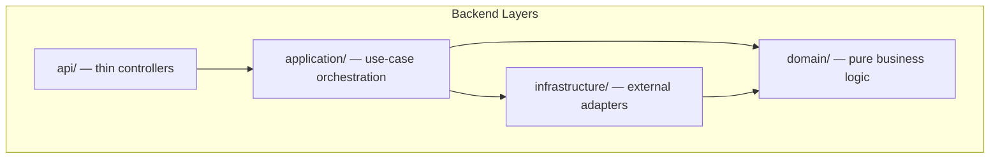

# Folio — Development Guide

This guide covers everything you need to contribute to Folio: local setup, dependency management, CI pipeline, architecture boundaries, testing, logging, and security internals.

---

## Table of Contents

- [Prerequisites](#prerequisites)
- [First-time setup](#first-time-setup)
- [Python version pinning](#python-version-pinning)
- [Dependency management (uv)](#dependency-management-uv)
- [Frontend development](#frontend-development)
- [API type codegen](#api-type-codegen)
- [Dev Container / Codespaces](#dev-container--codespaces)
- [CI pipeline](#ci-pipeline)
- [Test coverage](#test-coverage)
- [Architecture](#architecture)
- [Project structure](#project-structure)
- [Logging](#logging)
- [Security internals](#security-internals)

---

## Prerequisites

| Tool | Version | Purpose |
|---|---|---|
| Docker + Docker Compose | Any recent | Running the full stack |
| Python | **3.12** (pinned) | Backend development and codegen |
| Node.js | 20+ | Frontend development |
| [uv](https://docs.astral.sh/uv/) | Latest | Python dependency management |

---

## First-time Setup

```bash
# Install uv if not already installed
curl -LsSf https://astral.sh/uv/install.sh | sh

# Install all deps, generate API types, install pre-commit hooks
make setup

# Start the full stack
docker compose up -d

# Verify everything passes
make ci
```

After setup, the development workflow is:

```bash
make ci-quick           # fast loop: lint + tests
make backend-test-quick # even faster: backend tests only, no coverage
make format             # format all code (backend + frontend)
make lint               # lint backend (ruff) + frontend (ESLint)
```

---

## Python Version Pinning

CI runs **Python 3.12**, pinned in `.python-version` and `.github/workflows/ci.yml`. Your local venv must use the same minor version — the OpenAPI spec generator (`make generate-api`) produces different output on Python 3.13+, which causes the `check-api-spec` CI job to fail.

```bash
pyenv install 3.12   # install Python 3.12 if not already present
pyenv local 3.12     # picks up .python-version automatically
make install         # rebuild venv with the correct Python (also regenerates uv.lock)
```

`make generate-api` and `make check-api-spec` will warn if your venv Python does not match `.python-version`.

---

## Dependency Management (uv)

Backend dependencies are managed with [uv](https://docs.astral.sh/uv/) for fast, reproducible builds.

| File | Purpose |
|---|---|
| `backend/pyproject.toml` | Direct dependencies with loose version constraints — **edit this** |
| `backend/uv.lock` | Auto-generated lock file with all transitive deps pinned — **do not edit by hand** |

```bash
make lock      # re-resolve pyproject.toml → uv.lock (run after editing pyproject.toml)
make upgrade   # re-lock all deps to latest compatible versions
make install   # uv sync from lock file (rebuilds venv)
```

Both `pyproject.toml` and `uv.lock` must be committed. Docker builds use `uv sync --frozen` for reproducibility.

**To add a dependency:**
1. Add it to `[project.dependencies]` in `backend/pyproject.toml`
2. Run `make lock`
3. Commit both files

---

## Frontend Development

```bash
cd frontend-react
npm run dev      # dev server at http://localhost:3000 (with HMR)
npm run build    # production build
npm run lint     # ESLint
```

Frontend TypeScript types in `frontend-react/src/api/types/` are generated from the backend OpenAPI spec. See [API type codegen](#api-type-codegen) below.

---

## API Type Codegen

Frontend TypeScript types are derived from the backend OpenAPI spec to prevent schema drift.

```bash
make generate-api   # export OpenAPI spec + regenerate TypeScript types
```

| File | Status | Purpose |
|---|---|---|
| `frontend-react/src/api/openapi.json` | Committed | API contract — reviewable in PRs |
| `frontend-react/src/api/types/generated.d.ts` | Gitignored | Build artifact — regenerated each time |

**When to run:** After changing any Pydantic schema in `backend/api/schemas/`, run `make generate-api` before committing. CI enforces this with `make check-api-spec`.

---

## Dev Container / Codespaces

Open the repo in VS Code with the Dev Containers extension, or launch it on GitHub Codespaces. The container automatically runs `make setup` and forwards ports 3000 (frontend) and 8000 (backend).

---

## CI Pipeline

`make ci` mirrors all GitHub Actions jobs and runs them in three parallelized phases. If it passes locally, the pipeline will pass.

```bash
make ci          # full CI — lint + tests + build + security + typechecks
make ci-quick    # fast CI — lint + tests only
```

**GitHub CI job mapping:**

| GitHub CI Job | Local command |
|---|---|
| Backend Tests (coverage ≥ 85%) | `make backend-test` |
| Lint (ruff) | `make backend-lint` |
| OpenAPI Spec Freshness | `make check-api-spec` |
| Frontend Lint | `make frontend-lint` |
| Frontend Format Check (Prettier) | `make frontend-format-check` |
| Frontend Build | `make frontend-build` |
| Frontend Tests (coverage thresholds) | `make frontend-test` |
| Frontend Security (npm audit) | `make frontend-security` |
| Backend/Frontend Constant Sync | `make check-constants` |
| Security Audit (pip-audit) | `make backend-security` |
| CI Gate | _(aggregates all jobs — blocks PR merge on failure)_ |

**Merge protection:** `CI Gate` is the sole required status check in GitHub branch protection. Any job failure blocks the PR. Configure at: GitHub repo → Settings → Branches → Branch protection rules → `main` → Require status checks → add `CI Gate`.

**Individual commands:**

```bash
make test                  # all tests (backend pytest + frontend Vitest)
make lint                  # lint (ruff + ESLint)
make format                # format backend code
make check-api-spec        # verify OpenAPI spec matches backend
make backend-security      # pip-audit CVE scan
make frontend-security     # npm audit high-severity scan
make check-constants       # verify backend/frontend constants are in sync
make check-ci              # verify make ci covers all GitHub CI jobs
```

**Manual run without Make:**

```bash
cd backend
uv sync
LOG_DIR=/tmp/folio_test_logs DATABASE_URL="sqlite://" python -m pytest tests/ -v --tb=short
```

Tests use in-memory SQLite. All external services (yfinance, Telegram) are mocked — no network required.

---

## Test Coverage

Coverage is enforced via a **ratchet strategy** — thresholds only ever increase, never decrease.

| Layer | Threshold | Config location |
|---|---|---|
| Backend | ≥ 85% | `--cov-fail-under=85` in `Makefile` and `.github/workflows/ci.yml` |
| Frontend lines | ≥ 4% | `coverage.thresholds.lines` in `frontend-react/vitest.config.ts` |
| Frontend branches | ≥ 60% | `coverage.thresholds.branches` in `frontend-react/vitest.config.ts` |
| Frontend functions | ≥ 25% | `coverage.thresholds.functions` in `frontend-react/vitest.config.ts` |

`src/components/ui/` is excluded from frontend coverage — those are third-party shadcn/ui wrappers.

**To raise the floor:** improve coverage, confirm locally with `make backend-test` / `make frontend-test`, then bump `--cov-fail-under` in both `Makefile` and `.github/workflows/ci.yml` and commit as the new baseline.

> **Important:** Do NOT set `fail_under` in `[tool.coverage.report]` in `backend/pyproject.toml`. This affects all `coverage` subcommands including those run by `py-cov-action/python-coverage-comment-action`, causing CI to fail with exit code 2. Use `--cov-fail-under=N` on the pytest command line only.

---

## Architecture

Folio's backend follows Clean Architecture with four layers. Dependencies flow inward only.



**Layer responsibilities:**

| Layer | Directory | Sub-packages | Responsibilities | May import |
|---|---|---|---|---|
| Domain | `domain/` | `core/` · `analysis/` · `portfolio/` | Pure business rules, calculations, enums. No framework dependencies. Unit-testable in isolation. | stdlib, `domain.*` only |
| Application | `application/` | `stock/` · `scan/` · `portfolio/` · `guru/` · `messaging/` · `settings/` | Use case orchestration — coordinate repositories and adapters to complete business flows. | `domain.*`, `infrastructure.*` |
| Infrastructure | `infrastructure/` | `market_data/` · `persistence/` · `external/` | External adapters: DB, yfinance, Telegram, SEC EDGAR, CoinGecko. Replaceable without affecting business logic. | `domain.*` |
| API | `api/` | `routes/` · `schemas/` | Thin controllers: parse HTTP request → call service → return response. | `application.*`, `domain.*`, `infrastructure.database` only |

**Architecture boundaries are enforced by `backend/tests/test_architecture.py`** (runs as part of `make ci`).

**Key rules:**
- `api/routes/` must delegate to `application/<domain>/` services — never call infrastructure directly
- `domain/` must not import from any outer layer
- The only infrastructure import allowed in `api/` is `infrastructure.database` (`get_session`, `engine`)

**Notification display names:**
All Telegram and chat notifications that display stock identifiers **must** use `format_stock_display(name, ticker)` from `application/formatters.py`. Use `resolve_display_names(tickers, session)` for batch name resolution before building notification messages. Never display a bare ticker symbol (e.g. `"AAPL"`, `"01311143"`) directly to users. This rule is enforced by the `TestNotificationDisplayNames` test in `test_architecture.py`.

Old flat import paths (e.g. `from domain.constants import X`, `from infrastructure.repositories import Y`) are preserved via backward-compatibility shims.

---

## Project Structure

```
azusa-stock/
├── backend/
│   ├── Dockerfile
│   ├── pyproject.toml                # direct dependencies (edit this)
│   ├── uv.lock                       # pinned lock file (auto-generated)
│   ├── main.py                       # app entry point, route registration
│   ├── logging_config.py             # centralized logging (shared across layers)
│   │
│   ├── domain/                       # Domain layer — pure business logic
│   │   ├── core/
│   │   │   ├── constants.py          # thresholds, cache config, shared messages
│   │   │   ├── enums.py              # category/status enums
│   │   │   ├── entities.py           # SQLModel tables
│   │   │   ├── protocols.py          # MarketDataProvider Protocol
│   │   │   └── formatters.py         # signal formatting utilities
│   │   ├── analysis/
│   │   │   ├── analysis.py           # pure calculations: RSI, Bias, decision engine, TWR
│   │   │   ├── fx_analysis.py        # FX risk analysis
│   │   │   └── smart_money.py        # Smart Money resonance calculations
│   │   └── portfolio/
│   │       ├── tax_wrapper.py        # NISA/iDeCo quota calculations (cost basis)
│   │       ├── eligibility.py        # asset eligibility rule engine
│   │       ├── asset_location.py     # tax-efficient asset location optimization
│   │       ├── routing.py            # NISA-first purchase routing
│   │       ├── detax.py              # DeTAX tax-loss harvesting logic
│   │       ├── rebalance.py          # pure drift analysis
│   │       ├── withdrawal.py         # Liquidity Waterfall smart withdrawal
│   │       └── stress_test.py        # CAPM stress test simulation
│   │
│   ├── application/                  # Application layer — use case orchestration
│   │   ├── stock/                    # stock and fundamentals services
│   │   ├── scan/                     # scanner and cache warm-up services
│   │   ├── portfolio/                # holdings, rebalance, stress test, FX, tax services
│   │   │   ├── transaction_service.py
│   │   │   ├── settlement_service.py
│   │   │   ├── account_service.py
│   │   │   ├── analytics_service.py
│   │   │   ├── insight_service.py
│   │   │   ├── wrapper_service.py    # NISA/iDeCo quota management
│   │   │   ├── eligibility_service.py
│   │   │   ├── routing_service.py
│   │   │   └── nav_sync_service.py   # mutual fund NAV sync
│   │   ├── guru/                     # Smart Money and resonance services
│   │   ├── messaging/                # notifications, webhook, Telegram settings
│   │   ├── settings/                 # preferences, personas, snapshots
│   │   ├── services.py               # backward-compat facade
│   │   └── formatters.py             # Telegram HTML formatting (shared)
│   │
│   ├── infrastructure/               # Infrastructure layer — external adapters
│   │   ├── database.py               # SQLite engine + session (importable from api/)
│   │   ├── market_data/
│   │   │   ├── market_data.py        # yfinance adapter (cache + rate limiter + retry)
│   │   │   ├── market_data_resolver.py
│   │   │   ├── toushin_adapter.py    # mutual fund NAV from toushin-lib
│   │   │   ├── finmind_adapter.py    # FinMind API (TW stocks)
│   │   │   └── jquants_adapter.py    # J-Quants API (JP stocks)
│   │   ├── persistence/
│   │   │   └── repositories.py       # Repository pattern — all DB queries
│   │   └── external/
│   │       ├── notification.py       # Telegram Bot adapter (dual-mode)
│   │       ├── sec_edgar.py          # SEC EDGAR 13F scraper
│   │       └── crypto.py             # Fernet encryption utility
│   │
│   ├── api/                          # API layer — thin controllers
│   │   ├── schemas/                  # Pydantic request/response schemas
│   │   │   ├── common.py
│   │   │   ├── stock.py
│   │   │   ├── scan.py
│   │   │   ├── portfolio.py
│   │   │   ├── guru.py
│   │   │   ├── fx_watch.py
│   │   │   ├── wrapper.py
│   │   │   └── notification.py
│   │   ├── routes/                   # route sub-package
│   │   │   ├── stock_routes.py
│   │   │   ├── thesis_routes.py
│   │   │   ├── scan_routes.py
│   │   │   ├── snapshot_routes.py
│   │   │   ├── persona_routes.py
│   │   │   ├── holding_routes.py
│   │   │   ├── telegram_routes.py
│   │   │   ├── preferences_routes.py
│   │   │   ├── fx_watch_routes.py
│   │   │   ├── wrapper_routes.py
│   │   │   └── guru_routes.py
│   │   ├── dependencies.py
│   │   └── rate_limit.py
│   │
│   ├── config/
│   │   ├── system_personas.json      # 6 investor personality templates
│   │   └── templates/                # import templates (stock / holding)
│   │
│   ├── scripts/
│   │   └── migrate_ledger.py         # migrate holdings → OPENING_BALANCE transactions
│   │
│   └── tests/                        # test suite mirroring backend structure
│       ├── conftest.py               # shared fixtures (TestClient, in-memory DB, mocks)
│       ├── domain/
│       ├── application/
│       ├── api/routes/
│       └── infrastructure/
│
├── frontend-react/
│   ├── Dockerfile                    # multi-stage: Node build → nginx serve
│   ├── package.json
│   ├── src/
│   │   ├── api/                      # TanStack Query hooks + axios + generated types
│   │   ├── components/               # page components
│   │   ├── hooks/                    # useTheme, usePrivacyMode, useLanguage, usePlotlyTheme
│   │   ├── lib/                      # constants.ts, i18n.ts
│   │   └── pages/                    # Dashboard, Radar, Backtest, Allocation, FxWatch, SmartMoney
│   └── public/locales/               # i18n JSON (en, zh-TW, ja, zh-CN)
│
├── docs/
│   ├── USER_GUIDE.md                 # end-user feature guide
│   ├── DEVELOPMENT.md                # this file
│   ├── API.md                        # full API reference
│   ├── adr/                          # Architecture Decision Records
│   ├── runbooks/                     # operational runbooks
│   └── agents/                       # AI agent docs (SKILL.md, reference.md, AGENTS.md)
│
├── scripts/
│   ├── check_constant_sync.py        # backend/frontend constant sync check
│   ├── check_ci_completeness.py      # verify make ci covers all GitHub CI jobs
│   ├── export_openapi.py             # export FastAPI OpenAPI spec
│   ├── import_stocks.py              # import stocks from JSON
│   └── data/folio_watchlist.json     # default sample watchlist
│
├── .env.example                      # all available environment variables
├── docker-compose.yml
├── Makefile
└── logs/                             # bind-mounted log files
    ├── radar.log                     # current day
    └── radar.log.YYYY-MM-DD          # rotated history (3 days retained)
```

---

## Logging

Log files are bind-mounted to `logs/` in the project root, accessible directly on the host.

```bash
tail -f logs/radar.log   # live tail
```

**Rotation:** Daily at UTC midnight. Last 3 days of history are retained; older files are deleted automatically.

**Log format:** `2026-02-09 14:30:00 | INFO | main | Message here.`

### Environment variables

| Variable | Default | Description |
|---|---|---|
| `LOG_LEVEL` | `INFO` | `DEBUG` / `INFO` / `WARNING` |
| `LOG_DIR` | `/app/data/logs` | Log directory path |
| `LOG_FORMAT` | `text` | `text` (human-readable) or `json` (structured, for ELK/Loki/Grafana) |

### JSON log format (`LOG_FORMAT=json`)

Each line is a single JSON object:

```json
{
  "timestamp": "2026-03-20 14:30:00",
  "level": "INFO",
  "request_id": "a1b2c3d4",
  "method": "GET",
  "path": "/api/stocks",
  "status": 200,
  "latency_ms": 42.5,
  "logger": "application.stock.stock_service",
  "message": "..."
}
```

`method`, `path`, `status`, and `latency_ms` are only present in HTTP request context; background thread logs have `null` for those fields.

### Optional observability

**Sentry error tracking:**

```bash
# In backend/ directory
uv add "sentry-sdk[fastapi]"
# In .env
SENTRY_DSN=https://xxx@xxx.ingest.sentry.io/xxx
```

After configuration, unhandled exceptions and slow requests are reported to Sentry automatically. See `.env.example` for `SENTRY_TRACES_SAMPLE_RATE`.

**Prometheus / OpenTelemetry:** Not built-in. If needed, add [`prometheus-fastapi-instrumentator`](https://github.com/trallnag/prometheus-fastapi-instrumentator) to expose `/metrics`, or `opentelemetry-instrumentation-fastapi` for distributed tracing. Open an issue if you want this officially supported.

---

## Security Internals

### API authentication

In production mode, all API requests require an `X-API-Key` header.

```bash
# 1. Generate a key
make generate-key

# 2. Add to .env
FOLIO_API_KEY=your-generated-key

# 3. Restart
docker compose up --build -d

# Correct request
curl -H "X-API-Key: your-key" http://localhost:8000/summary

# Wrong — returns 401
curl http://localhost:8000/summary
```

**Dev mode:** If `FOLIO_API_KEY` is not set, authentication is disabled. No configuration needed for local development.

> When integrating with OpenClaw or other AI agents, add the `X-API-Key` header in your webhook configuration.

### Data encryption

Custom Telegram Bot Tokens stored in the database are encrypted with Fernet symmetric encryption (AES-128-CBC + HMAC-SHA256).

```bash
# 1. Generate a Fernet key
python -c "from cryptography.fernet import Fernet; print(Fernet.generate_key().decode())"

# 2. Add to .env
FERNET_KEY=your-fernet-key

# 3. Restart (existing tokens are auto-encrypted on startup)
docker compose up --build -d
```

> Store `FERNET_KEY` in a password manager or secure vault. Losing it means stored tokens cannot be decrypted. Dev mode (no `FERNET_KEY`) stores tokens as plaintext and logs a warning.

### Other security mechanisms

| Mechanism | Details |
|---|---|
| Rate limiting | Scan, Webhook, and Digest endpoints: 5 req/min per IP |
| Input validation | Batch imports: max 1,000 rows; file uploads: max 5 MB; Pydantic type validation prevents injection |
| Error masking | API errors never expose internal implementation details — only standardized `error_code` + generic message |
| Docker isolation | All services run as non-root users inside containers |
| Privacy mode | Frontend one-click mask of amounts, quantities, and Chat ID; persists to database |
| Dependency scanning | CI runs `pip-audit` (backend) and `npm audit` (frontend); local: `make backend-security` / `make frontend-security` |

### Known CVE waivers

| CVE | Package | Status | Rationale |
|---|---|---|---|
| CVE-2025-69872 | `diskcache` | No fix available | Pickle deserialization. Cache directory is inside the Docker container, not exposed externally; container runs as non-root. Remote exploitation requires prior container write access. See [`docs/adr/0005-diskcache-cve-2025-69872-waiver.md`](adr/0005-diskcache-cve-2025-69872-waiver.md). |

### Security best practices

1. **Rotate dependencies regularly** — run `make upgrade` then `make install` to pull latest compatible versions
2. **Back up `FERNET_KEY`** — store it alongside your database backup in a secure vault
3. **Use a reverse proxy** — in production, place Nginx or Caddy in front with HTTPS
4. **Monitor logs** — watch `logs/radar.log` for repeated 403 or 429 errors
