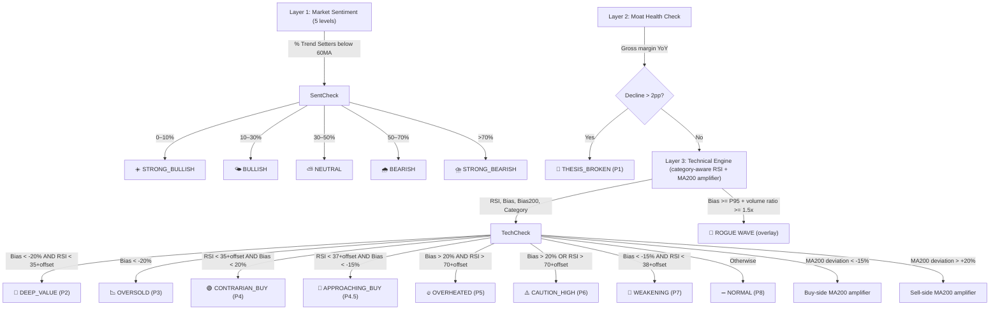

# Folio — User Guide

This guide covers all end-user features: what each page does, how to import data, how to set up Telegram notifications, and how to manage your data over time.

---

## Table of Contents

- [Pages overview](#pages-overview)
- [Watchlist & Categories](#watchlist--categories)
- [Signal Scanner (Radar)](#signal-scanner-radar)
- [Scanning logic — V2 three-layer funnel](#scanning-logic--v2-three-layer-funnel)
- [Backtest Dashboard](#backtest-dashboard)
- [Portfolio (War Room)](#portfolio-war-room)
- [NISA Center](#nisa-center)
- [FX Watch](#fx-watch)
- [Smart Money (Guru Tracker)](#smart-money-guru-tracker)
- [Notifications](#notifications)
- [Import: Watchlist (JSON)](#import-watchlist-json)
- [Import: Holdings (CSV / TSV)](#import-holdings-csv--tsv)
- [Telegram Bot setup](#telegram-bot-setup)
- [PWA installation](#pwa-installation)
- [Language switching](#language-switching)
- [Data management](#data-management)

---

## Pages Overview

| Page | Path | Purpose |
|---|---|---|
| Dashboard | `/` | Portfolio overview — market sentiment, total value, YTD TWR, allocation, signals |
| Radar | `/radar` | Watchlist with live scan signals, filters, thesis management |
| Backtest | `/backtest` | Signal hit-rate, average return, false-positive rate by window |
| War Room | `/allocation` | Ledger-driven holdings, rebalance, stress test, smart withdrawal |
| NISA Center | `/nisa` | NISA / iDeCo quota, eligible assets, routing, DeTAX |
| FX Watch | `/fx-watch` | Currency pair monitoring and exchange timing alerts |
| Smart Money | `/smart-money` | SEC 13F guru tracker, consensus holdings, heatmap, backtest |
| Settings | `/settings` | Telegram configuration, language, privacy mode, app preferences |

---

## Watchlist & Categories

Every stock is assigned exactly one category, which controls how it participates in scanning.

| Category | Purpose | Layer 1 sentiment |
|---|---|:---:|
| **Trend Setter** | Large ETFs and mega-caps — monitor capital flow and Capex. ETFs are excluded from sentiment ratio calculation. | Yes |
| **Moat** | Irreplaceable "shovel sellers" in the supply chain | No |
| **Growth** | High-volatility, high-imagination growth stocks | No |
| **Mutual_Fund** | NISA/iDeCo fund codes — NAV sourced daily from toushin-lib, not yfinance | No |
| **Bond** | Government bonds and investment-grade bond ETFs | No |
| **Cash** | Idle cash — manual entry, no signal scanning | No |

**Additional features:**
- Thesis version control — every thesis update auto-increments a version number and preserves full history
- Dynamic tags — label stocks with domain tags (AI, Cloud, SaaS…) snapshot-linked to each thesis version
- Earnings calendar with 14-day countdown; dividend yield and ex-date display
- Fundamentals tab on stock cards: P/E, EPS, market cap, P/B, P/S, ROE, revenue/profit growth
- Archive & restore — removed stocks are archived with a removal reason and can be reactivated
- Drag-and-drop ordering, persisted to the database

---

## Signal Scanner (Radar)

The scanner evaluates every tracked stock and assigns one of 9 signal levels. Signals are persisted — you can view a stock's signal timeline and count of consecutive anomalies.

**Signal levels:**

| Signal | Emoji | Priority |
|---|---|---|
| `THESIS_BROKEN` | 🚨 | P1 |
| `DEEP_VALUE` | 💎 | P2 |
| `OVERSOLD` | 📉 | P3 |
| `CONTRARIAN_BUY` | 🟢 | P4 |
| `APPROACHING_BUY` | 🎯 | P4.5 |
| `OVERHEATED` | 🔥 | P5 |
| `CAUTION_HIGH` | ⚠️ | P6 |
| `WEAKENING` | 🔻 | P7 |
| `NORMAL` | ➖ | P8 |

Overlays (stacked on top of the base signal):
- 🌊 **Rogue Wave** — deviation ≥ P95 vs 3-year history AND volume ratio ≥ 1.5x
- 📈 **Volume spike** — volume ratio ≥ 1.5x (modifies notification priority)
- 📉 **Volume shrink** — volume ratio ≤ 0.5x

**Multi-filter panel:** Combine signal, RSI/Bias/volume range, market cap bucket, P/E, yield, sector, tags, and holdings-only filters.

**Market filter pills:** When your watchlist spans multiple markets (US/TW/JP/HK), market filter pills appear for one-click filtering.

---

## Scanning Logic — V2 Three-Layer Funnel



**RSI offset by category:** Growth stocks use a higher RSI threshold (more aggressive) while Bond/Moat stocks use a lower threshold, reflecting different typical beta profiles.

**MA200 amplifier:** When a stock's price deviates significantly from its 200-day MA, borderline signals are automatically upgraded (buy-side: edge signals become `CONTRARIAN_BUY`; sell-side: edge signals become `CAUTION_HIGH`).

**Smart scan:** The scanner checks data freshness every 30 minutes. It only pushes a Telegram notification when a signal *changes* — no duplicate alerts.

---

## Backtest Dashboard

Tracks every historical signal event and measures forward returns over 5/10/30/60 trading-day windows.

- **Hit rate** — percentage of signals that led to the predicted outcome
- **Average return** — mean forward return over each window
- **False positive rate** — signals that reversed within the window
- **Confidence level** — based on sample size (displayed alongside each metric)

**Cold-start backfill:** On a fresh deployment, the system automatically replays up to 2 years of historical signals in the background (low priority). A progress API lets the frontend show backfill status.

**Export:** Download all backtest events as CSV for your own analysis.

---

## Portfolio (War Room)

War Room is the ledger-driven portfolio management section. Holdings are derived exclusively from transaction records — there is no manual position editing.

### Transactions

Supported transaction types: `BUY`, `SELL`, `DIVIDEND`, `DEPOSIT`, `WITHDRAWAL`, `OPENING_BALANCE`, `ADJUSTMENT`, `STOCK_SPLIT`, `TRANSFER_IN`, `TRANSFER_OUT`.

Use `OPENING_BALANCE` when setting up a new account with existing holdings. Use `ADJUSTMENT` for manual corrections.

### Accounts

Group holdings by brokerage account. Each account has a type (general, NISA Tsumitate, NISA Growth, iDeCo, specific account). The account center shows holdings per account and provides an aggregated view.

### Rebalance Analysis

- Target vs actual allocation diff with drift percentage
- Rebalance suggestions (how much to buy/sell per category)
- **ETF X-Ray** — resolves ETF holdings to underlying stocks, computes direct + indirect exposure; auto-warns when a position exceeds the concentration threshold
- X-Ray fatigue suppression: confirm a known concentration and mute re-alerts until it materially worsens

### Stress Test

Simulates a market crash scenario from −50% to 0%. Uses CAPM Beta to calculate expected loss per holding and assigns a "pain level" (calm breeze / noticeable correction / serious damage / sleepless nights).

### Smart Withdrawal (Liquidity Waterfall)

"I need ¥500,000 to travel — what should I sell?" Enter an amount and currency; the algorithm suggests what to sell using three priority tiers:
1. Rebalancing over-weight positions
2. Tax-loss harvesting opportunities
3. Liquidity (most liquid positions)

### Other War Room features

- **FX return decomposition** — purchase FX rate snapshot on every new position; details show local return vs FX return
- **Geographic allocation** — breakdown by region (US / TW / JP / HK)
- **Asset class allocation** — Equity / Fixed Income / Alternatives / Cash
- **Drawdown analysis** — peak-to-trough with recovery area chart
- **Risk metrics** — Sharpe ratio, Sortino ratio, Calmar ratio, annualized volatility
- **Contribution vs growth** — stacked area chart: cumulative deposits vs market appreciation
- **Natural language insights** — plain-text portfolio summary with recommendations
- **Privacy mode** — one-click mask of all amounts and quantities; persists across devices
- **Onboarding wizard** — three-step guided setup for first-time users
- **Broker CSV templates** — pre-mapped columns for IB, Firstrade, SBI, Rakuten, Fubon
- **Terminology mode** — toggle between expert and simplified financial terms
- **Progressive disclosure** — advanced metrics hidden by default, expandable on demand

---

## NISA Center

Dedicated page for Japan tax-advantaged accounts.

- **Quota dashboard** — real-time tracking of annual investment quota and lifetime tax-free quota at cost basis (not market value); supports 2026 quota restoration rules
- **Smart purchase routing** — auto-allocates to NISA first; overflow goes to specific account (特定口座)
- **Eligible asset verification** — Tsumitate NISA allows only approved funds (identified by 投信協會ファンドコード / 銘柄コード from the official list); Growth NISA auto-excludes leveraged and monthly-dividend products
- **Asset location optimization** — high-growth assets prioritized for tax-free accounts; includes tax efficiency score and estimated tax savings
- **DeTAX (automatic tax-loss harvesting)** — uses losing positions in specific accounts to offset gains; WealthNavi-style, estimated 0.4–0.6% annualized tax reduction
- **Tax simulator** — NISA vs specific account 10/20/30-year compound comparison chart
- **Contribution ledger (拠出台帳)** — full record of all NISA/iDeCo contributions

---

## FX Watch

Monitor currency pairs and get alerted when exchange timing looks favorable.

**Supported currencies:** USD, TWD, JPY, EUR, GBP, CNY, HKD, SGD, THB — any pair combination.

**Two detection modes (configurable, OR logic):**
- **Recent high alert** — triggers when current rate is near its N-day high (configurable 5–90 days)
- **Consecutive rise alert** — triggers when the rate has risen for N consecutive days (configurable 2–10 days)

**Features:**
- Inline suggestion column: 🟢 Recommend exchange / ⚪ Hold
- 3-month interactive trend chart (1M/2M/3M period selector) with recent-high reference line
- Per-pair cooldown (1–168 hours) to prevent repeat alerts
- One-click enable/disable and manual check (without sending a notification)

---

## Smart Money (Guru Tracker)

Track institutional investors via SEC 13F filings.

**Setup:** Add a guru by providing their SEC CIK number. Sync fetches the latest 13F snapshot from SEC EDGAR.

**Features:**
- Investment style badges: VALUE / GROWTH / MACRO / QUANT / ACTIVIST / MULTI_STRATEGY
- Tier system: Tier 1 (Legend) / Tier 2 (Elite) / Tier 3 (Rising Star)
- **Activity Feed** — "Most Bought" and "Most Sold" leaderboard for the current quarter
- **Consensus Holdings** — individual action badges (NEW / INCREASED / DECREASED / SOLD / UNCHANGED), average weight, GICS sector
- **Holdings diff dashboard** — grouped by action, showing value, shares, change %, and weight
- **Top-N holdings chart** — interactive horizontal bar chart with action color coding
- **QoQ comparison** — cross-quarter snapshot: shares / weight / action per holding, with trend column (↑ / ↓ / ★ new / ✕ exited)
- **Grand Portfolio** — aggregated view across all tracked gurus: combined weight, avg weight, dominant action, sector breakdown
- **13F Heatmap** — Treemap visualization by sector or by guru; block size = combined weight, color = dominant action
- **Guru backtest** — simulate "copy the guru's portfolio on filing date" vs SPY/VT; cumulative return chart, quarterly breakdown, Alpha
- **Post-filing performance** — add `?include_performance=true` to holdings/top endpoints for price change % since filing date
- **Great Minds Think Alike** — auto-match your watchlist and holdings against all tracked guru 13F holdings; resonance badge (🏆×N) appears on Radar stock cards

**Note:** 13F filings have a 45-day reporting delay. The system automatically syncs daily during reporting season (Feb/May/Aug/Nov) and weekly otherwise.

---

## Notifications

### Telegram alerts

All notifications go through Telegram. Configure in `.env` or via War Room → Telegram Settings.

| Alert type | Trigger |
|---|---|
| Signal change | When a stock's scan signal changes |
| Price alert | When RSI / price / deviation crosses a user-set threshold |
| Weekly digest | Every Sunday 18:00 UTC — total value WoW, S&P 500 alpha, health score, top movers, anomalies, drift, Smart Money |
| Drift reminder | When portfolio allocation drifts beyond threshold |
| FX alert | When a currency pair meets your exchange timing criteria |
| Stock split | When a held stock splits — notify, manual apply, or auto-apply |
| Dividend | When a held stock pays a dividend — notify, manual apply, or auto-apply |
| X-Ray alert | When ETF concentration exceeds threshold |

### Dual-mode notification

- **System bot** (`.env` `TELEGRAM_BOT_TOKEN` / `TELEGRAM_CHAT_ID`) — affects all users
- **Custom bot** (War Room → Telegram Settings → custom token) — per-user override; takes precedence when enabled

---

## Import: Watchlist (JSON)

**Via UI:** Dashboard sidebar → "Import Watchlist" → upload JSON file.

**Via CLI:**

```bash
python3 -m venv .venv && source .venv/bin/activate && pip install requests
python scripts/import_stocks.py                    # default sample watchlist
python scripts/import_stocks.py path/to/my.json   # custom file
```

Both methods support **upsert** — existing stocks are updated (thesis version incremented), not duplicated.

**JSON format:**

```json
[
  {
    "ticker": "NVDA",
    "category": "Moat",
    "thesis": "Your investment thesis here.",
    "tags": ["AI", "Semiconductor"]
  }
]
```

| Field | Required | Values |
|---|---|---|
| `ticker` | Yes | Stock ticker (e.g. `AAPL`, `2330.TW`, `7203.T`) |
| `category` | Yes | `Trend_Setter` / `Moat` / `Growth` / `Mutual_Fund` / `Bond` / `Cash` |
| `thesis` | Yes | Your investment thesis text |
| `tags` | No | Array of domain tag strings (default: `[]`) |

---

## Import: Holdings (CSV / TSV)

War Room sidebar → "Import Holdings" → upload `.csv` or `.tsv` file.

1. **Column mapping** — map your file's columns to Folio fields (ticker / quantity / category / cost basis / etc.)
2. **Preview & validation** — review data and errors before confirming
3. **Import** — currently Replace-all mode (existing holdings are cleared and rebuilt from the import)

Each imported row creates an `OPENING_BALANCE` transaction; holdings are derived from transactions.

**CSV format example:**

```csv
ticker,category,quantity,cost_basis,currency,broker,account_type,account_id
AAPL,Growth,10,150.00,USD,Interactive Brokers,,1
2330.TW,Moat,100,580.00,TWD,Fubon,,2
7203.T,Growth,200,2800.00,JPY,Rakuten,,3
USD,Cash,50000,1.00,USD,Bank of America,savings,4
```

| Field | Required | Notes |
|---|---|---|
| `ticker` | Yes | |
| `quantity` | Yes | |
| `category` | Yes | |
| `account_id` | Yes | Must match an existing account ID |
| `currency` | No | Inferred from market if omitted |
| `broker` | No | |
| `cost_basis` | No | Per-unit cost |
| `account_type` | No | |

---

## Telegram Bot Setup

<details>
<summary>Step-by-step guide (click to expand)</summary>

### Step 1 — Create a bot via BotFather

1. Open Telegram and search for **@BotFather**, then start a conversation.
2. Send `/newbot`.
3. Follow the prompts:
   - **Bot name** (display name, e.g. `Folio`)
   - **Bot username** (unique, must end in `bot`, e.g. `folio_invest_bot`)
4. BotFather will reply with an **HTTP API Token** like:
   ```
   123456789:ABCdefGHI-jklMNOpqrSTUvwxYZ
   ```
5. Copy the token into `.env` as `TELEGRAM_BOT_TOKEN`.

### Step 2 — Get your Chat ID

**Personal chat (recommended):**

1. Search for **@userinfobot** and start a conversation.
2. Send `/start` — it replies with your user info. The `Id` field is your Chat ID (a plain number).
3. Copy it into `.env` as `TELEGRAM_CHAT_ID`.

**Group chat:**

1. Add your bot to the target group.
2. Send any message in the group.
3. Open `https://api.telegram.org/bot<TOKEN>/getUpdates` in a browser.
4. Find `"chat":{"id":-123456789}` in the JSON — the negative number is your group Chat ID.

### Step 3 — Verify

```bash
curl -s "https://api.telegram.org/bot<YOUR_TOKEN>/sendMessage" \
  -d chat_id=<YOUR_CHAT_ID> \
  -d text="Hello from Folio!"
```

If you receive a Telegram message, the setup is complete.

</details>

---

## PWA Installation

Folio's frontend is a PWA — install it for a near-native app experience.

| Platform | How to install |
|---|---|
| Desktop Chrome / Edge | Click the install icon in the address bar, or browser menu → "Install app" |
| Android Chrome | Browser menu → "Add to Home screen" |
| iOS Safari | Share menu → "Add to Home Screen" |

Benefits after installation:
- **Standalone mode** — runs without browser chrome
- **Offline App Shell** — previously loaded UI resources work offline
- **Update prompt** — a banner appears when a new version is deployed

---

## Language Switching

Folio supports four interface languages. Switch from the sidebar at any time — the setting is saved to the database and syncs across devices.

| Language | Code |
|---|---|
| Traditional Chinese | `zh-TW` (default) |
| English | `en` |
| 日本語 | `ja` |
| Simplified Chinese | `zh-CN` |

All UI text and Telegram notification messages switch to the selected language.

---

## Demo Mode

Demo Mode lets you show Folio to a colleague without risking your real portfolio or watchlist data. It runs a completely isolated stack — separate ports, separate database volume, separate Docker project — so your live instance on `:3000` is completely unaffected throughout.

### Start a demo

```bash
make demo
```

This builds images (if needed), starts the demo backend on `:8001` and frontend on `:3001`, and seeds the database with representative sample data (watchlist, accounts, holdings, and transactions) automatically.

A blue **Demo Mode** banner is shown at the top of every page so it is always clear which instance your audience is looking at.

### Reset demo data

```bash
make demo-reset
```

Wipes all data from the demo database and re-seeds it with the original sample data — useful when you want to start a fresh demo session without restarting containers.

### Stop and remove

```bash
make demo-down
```

Stops all demo containers **and removes the `demo-data` volume**, so no sample data lingers. Your production data volume (`radar-data`) is never touched.

### Both instances running side-by-side

| | Production | Demo |
|---|---|---|
| Frontend | http://localhost:3000 | http://localhost:3001 |
| Backend API | http://localhost:8000 | http://localhost:8001 |
| Database volume | `radar-data` | `demo-data` |
| Scanner | running | disabled |

---

## Data Management

### Upgrade (preserve data)

```bash
docker compose up --build -d
```

The container's entrypoint script handles file permission migration automatically — no manual steps needed when upgrading from an older version.

### Backup and restore

```bash
make backup                                        # backup to ./backups/
make restore                                       # restore latest backup
make restore FILE=backups/radar-20260214_153022.db # restore specific file
```

### Mutual Fund NAV sync

Mutual Fund (投資信託) NAV data is fetched daily from the Investment Trusts Association (toushin-lib.fwg.ne.jp) and stored in the `MutualFundNav` table. The sync interval is controlled by `NAV_SYNC_INTERVAL_HOURS` (default: 24 hours). Radar stock cards display a "NAV" badge with an "as of YYYY-MM-DD" timestamp.

### Ledger cleanup (post-migration)

```bash
make purge-legacy-dry   # preview what will be removed (no changes)
make purge-legacy       # remove orphaned holdings, orphaned transactions, zero-quantity ghost positions
```

Run after `make migrate-ledger` to clean up pre-ledger data.

### Refresh NISA eligible assets

```bash
make refresh-eligible   # sync NISA eligible asset list from official Investment Trusts Association source
```

Identification uses fund codes (投信協會ファンドコード / 銘柄コード), not fund names.

> **Note:** `make refresh-eligible`, `make migrate-ledger`, and `make purge-legacy` run inside the Docker container and write to the Docker volume (`/app/data/radar.db`, `radar-data` volume) — not `backend/data/radar.db` on the host.

### Full reset (delete all data)

```bash
make backup                  # always back up first
docker compose down -v       # removes Docker volumes (including radar.db)
docker compose up --build    # fresh start with empty database
```
